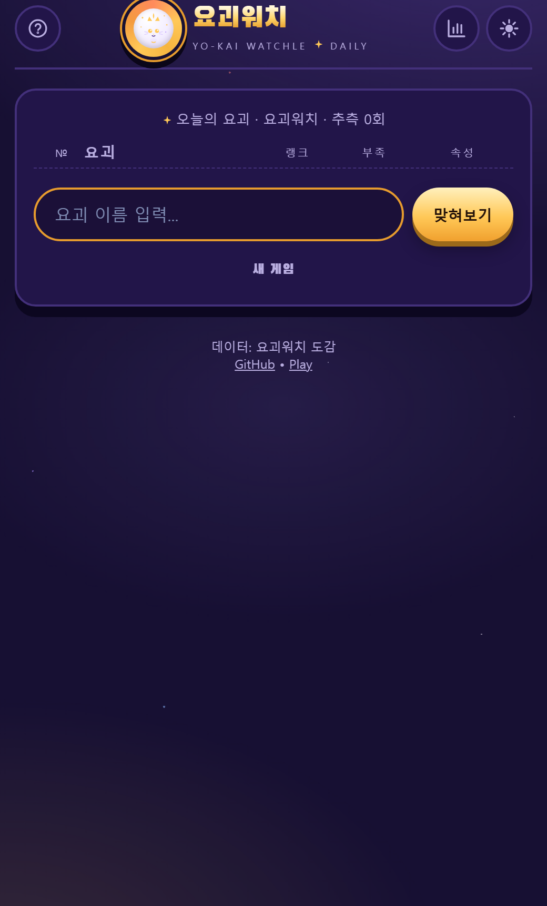
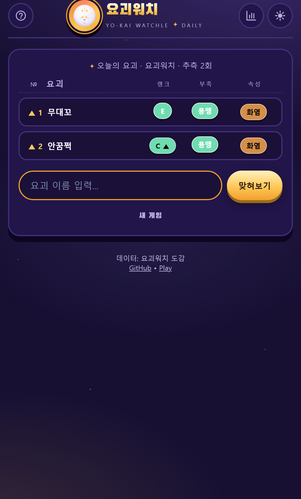
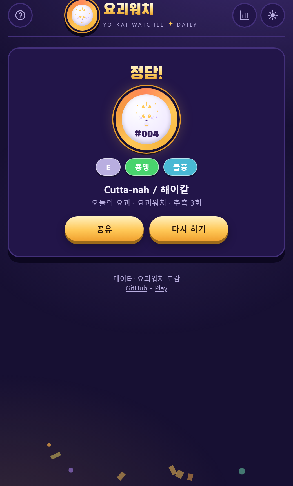
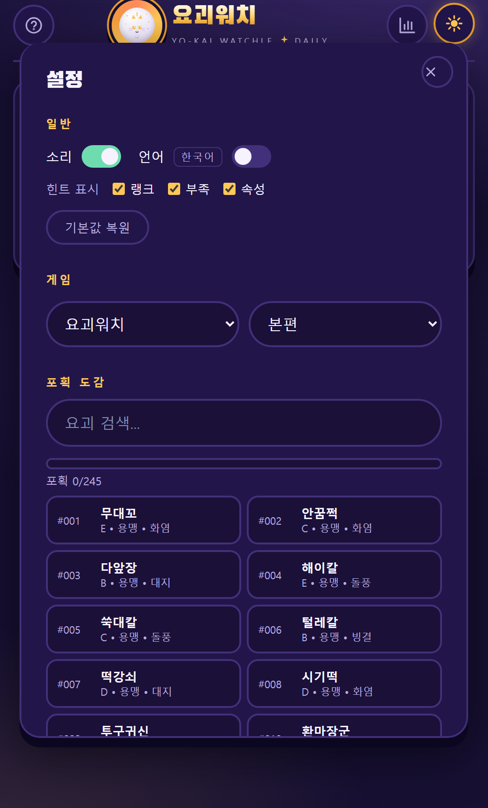

# 요괴워치 Watchle

매일 정해진 요괴 한 마리를 **이름으로** 맞히는 게임. 정답을 맞힌 뒤에 요괴의 랭크·부족·속성 힌트가 공개되고, 맞힐수록 실제 값과 점점 가까워집니다.

[게임 시작](https://spidychoipro.github.io/yokai-watchle/) · [GitHub](https://github.com/spidychoipro/yokai-watchle) · [English README](./README.md)

## 게임 방식

요괴 이름을 직접 입력합니다. 요괴워치 시리즈 정발판 이름(한글)과 영어 이름 모두 인식합니다.

- 요괴 **랭크** — 정답보다 높은지 낮은지 ▲/▼로 표시
- **부족 / 속성** — 틀려도 그 요괴의 실제 값을 색칠된 칸으로 보여줌
- 맞히면 초록색으로 표시되고, 게임이 끝납니다
- 추측 횟수 제한은 없습니다. 매일 자정(KST)에 다른 요괴가 출현합니다.

이름은 데이터베이스 기준으로 한글(정발/관용 표기 혹은 팬 번역)과 영어 모두 인식합니다.

## 스크린샷









행이 추가될 때 카드가 뒤집히고, 정답 칸은 빛나는 스윕 효과가 지나갑니다. 우측 상단 버튼은 연결된 웹폰트(`Black Han Sans`)와 별도로, 아이콘은 전부 인라인 SVG입니다.

## 플레이 가능한 도감

데이터에 구축된 roster를 기준으로 게임/버전을 고를 수 있습니다.

| 게임 | 버전 | 수록 수 |
|------|------|---------|
| 요괴워치 1 | 본편 | 245 |
| 요괴워치 2 | 본편 · 본편 2 · 본편 3 | 405 |
| 요괴워치 3 | 스시 · 텐푸라 · 스키야키 | 662 |
| 요괴워치 버스터즈 | 적묘단 · 백견대 · 월토조 | 392 · 392 · 368 |

## 동작하는 기능

- **오늘의 요괴**: 날짜(KST)별로 대상이 결정되어 자정에 바뀝니다.
- **힌트 설정**: 랭크·부족·속성 칸을 각각 켜고 끌 수 있습니다.
- **포획 도감**: 맞힌 요괴가 설정 탭의 도감에 수집됩니다. 진행률이 표시되고 검색됩니다.
- **통계**: 해결 수·연속·최고 연승과 추측 분포. 하루 정답은 1회만 집계됩니다.
- **공유**: 텍스트 형식(🟩🟨⬜)으로 결과를 공유합니다.
- **효과음**: WebAudio 기반 합성음(클릭·오답·승리), 설정에서 끌 수 있습니다.
- **EN/KO**: UI·게임 데이터(이름·부족·속성) 모두 번역됩니다. 어느 시리즈든 언어 설정에 따라 한글/영문 이름이 표기됩니다.
- **마스코트**: 요괴워치 IP를 직접 쓰지 않기 위해 "고양이 요괴" 실루엣의 오리지널 마스코트를 SVG로 직접 그리고, 헤더 메달·결과 화면·파비콘에 통일해서 사용합니다.

## 데이터는 어떻게 만들었나

게임에 쓰이는 이름 데이터는 전부 스크립트로 수집·병합했습니다.

- **영문/로스터**: Fandom의 Medallium Number 목록을 `tools/fetch-fandom.py`·`tools/scrape.mjs`로 긁어 원문 그대로 `data/raw/`에 저장
- **한글 이름**: 나무위키 기반 자료(`data/namu/`) + `tools/parse-namu.py`·`tools/merge-kr.mjs`로 `kr_pairs.json` 구축
- **검증/병합**: `tools/check-pairs.mjs`, `tools/merge-final.mjs`로 패어 검증 후 `build-data.mjs`가 `src/data.js`(단일 파일)를 재생성. 그 과정에서 `tools/compare-names.mjs`로 가지를 확인
- **버스터즈**(Rev 5): Fandom raw를 `tools/blasters-parse.mjs`로 파싱해 470종 → `tools/blasters-kr.mjs`가 한글명 470/470 매핑

외부 라이브러리 의존성은 없고, 빌드 산출물인 `src/data.js`를 정적 페이지가 그대로 읽습니다.

## 레포 구조

```
yokai-watchle/
├── src/                 # 게임 본체 (index.html + style.css + app.js + data.js)
├── data/                # 수집 원본·중간 산출물 (raw / namu / out)
├── tools/               # 데이터 수집·병합·검증 스크립트 (js / py)
├── assets/              # README 스크린샷
└── docs/                # PDCA 작업 문서 (plan / design / analysis / report)
```

## 로컬에서 실행

별도 빌드 없이 `src/`를 정적 서빙하면 됩니다.

```bash
cd src
python -m http.server 8000
# http://localhost:8000
```

`src/data.js`를 다시 만들 때만 `tools/`의 파이프라인을 실행하면 됩니다.

## 연혁

- **Rev 1** — 최초 버전: NYT 스타일 단어 맞추기 프로토타입
- **Rev 2~3** — 통계·공유·컨페티·효과음·도감·게임/버전 선택·언어 토글 추가
- **Rev 4** — "AI가 급조한 느낌" 지적 후 메달 컨셉 리디자인(골드 타이틀·별하늘 배경·스티커 카드) + 요괴워치 3를 영어 전용으로
- **Rev 5** — 요괴워치 버스터즈(적묘단/백견대/월토조) 데이터 추가, 한글판에서 요괴워치 3 선택 차단
- **Rev 6** — 인라인 SVG 아이콘 세트와 오리지널 고양이 요괴 마스코트, 보라-금색 테마 팔레트, 타일 뒤집기·정답 반짝임 애니메이션, EN/KO 번역 보완

## 라이선스

요괴워치 관련 명칭·캐릭터는 Level-5의 재산입니다. 이 프로젝트는 비공식 팬 프로젝트이며 README 이미지의 마스코트는 요괴워치 소재를 직접 쓰지 않은 오리지널 도안입니다. MIT 라이선스로 배포됩니다.